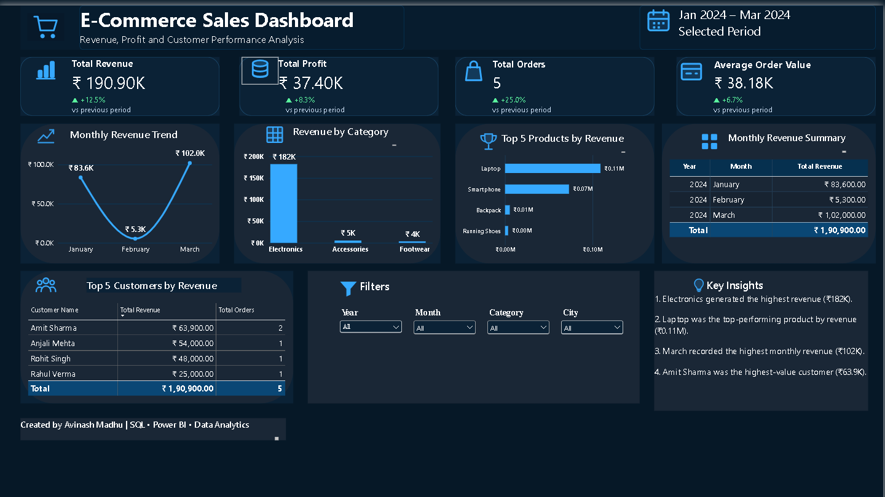

# SQL E-Commerce Data Analysis & Power BI Dashboard

## Project Overview
This project analyzes an e-commerce dataset using SQL and Power BI to uncover sales trends, customer behavior, and business performance metrics.

The project demonstrates the complete analytics workflow:
- Data extraction and analysis using SQL
- KPI calculation and business insights
- Interactive dashboard creation using Power BI

##  Project Workflow

1. **Database Setup** – Created the e-commerce database and tables using `schema.sql`.
2. **Data Loading** – Loaded the dataset using `data.sql`.
3. **SQL Analysis** – Used SQL queries to analyze sales, customers, products, revenue, and profit.
4. **KPI Analysis** – Calculated key business metrics such as total revenue, profit, orders, and average order value.
5. **Power BI Dashboard** – Connected the data to Power BI and built an interactive dashboard.
6. **Business Insights** – Identified revenue trends, top-performing categories, products, and customers.

## Tools Used
- MySQL
- SQL (JOINs, GROUP BY, Aggregations)
- Power BI
- Data Analysis Techniques

## 🔍 SQL Analysis

The project uses SQL to answer key business questions across sales, customers, products, and profitability.

### Queries Performed

1. **Total Revenue** – Calculated revenue from completed orders.
2. **Revenue by Category** – Compared revenue across product categories.
3. **Top Customers** – Ranked customers by total spending.
4. **Monthly Revenue Trend** – Analyzed revenue by month.
5. **Profit per Product** – Calculated profit for each product using selling price and product cost.

### SQL Techniques Used

- `JOIN` for combining customers, orders, order items, and products
- `SUM()` for revenue, spending, and profit calculations
- `GROUP BY` for category, customer, product, and monthly analysis
- `ORDER BY` for ranking customers by spending
- `WHERE` for filtering completed orders
- `DATE_FORMAT()` for monthly revenue analysis
- Calculated expressions for revenue and profit

The complete SQL queries are available in [`queries.sql`](queries.sql).

## Dataset
The dataset contains:
- Customers
- Orders
- Products
- Sales Transactions

## Key Business Questions Answered
1. Which product categories generate the highest revenue?
2. Which products contribute most to sales?
3. What are the monthly revenue trends?
4. Who are the top customers by revenue?
5. How does performance vary across categories?

## Dashboard KPIs
- Total Revenue: ₹190.9K
- Total Profit: ₹33.4K
- Total Orders: 5
- Average Order Value: ₹38.2K

## Dashboard Features
- Revenue Trend Analysis
- Category-wise Revenue Analysis
- Top Products by Revenue
- Customer Performance Analysis
- Dynamic Filters for City, Category, Month, and Year

##  Power BI Dashboard



## Key Insights

- **Electronics** generated the highest revenue among the product categories.
- **Laptops and smartphones** were the top-performing products by revenue.
- **March** recorded the highest monthly revenue in the analyzed period.
- A **small number of customers** accounted for a significant portion of total revenue.

##  Repository Structure

```text
SQL-Ecommerce-Analysis/
│
├── schema.sql
├── data.sql
├── queries.sql
├── Dashboard.png
└── README.md 
